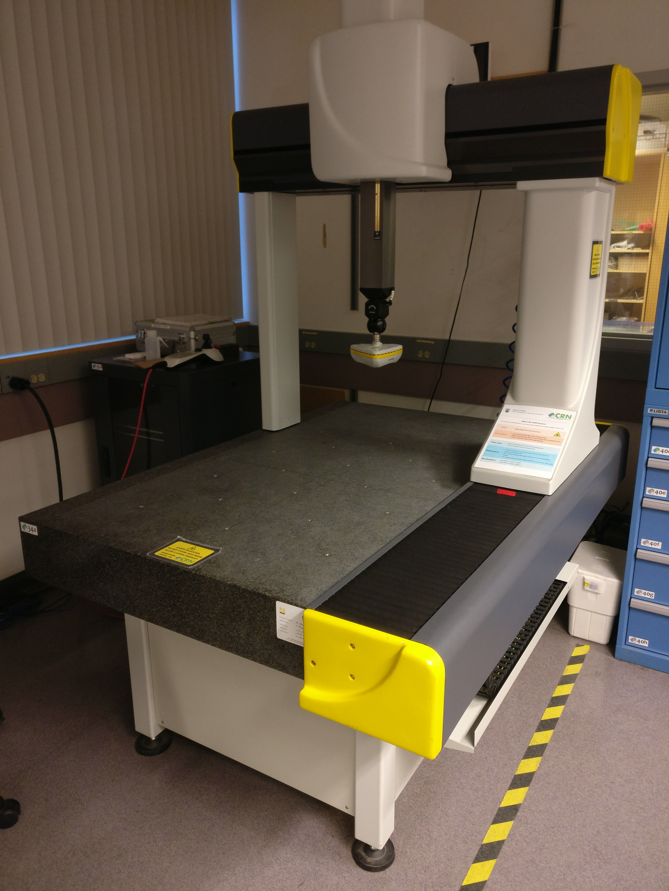
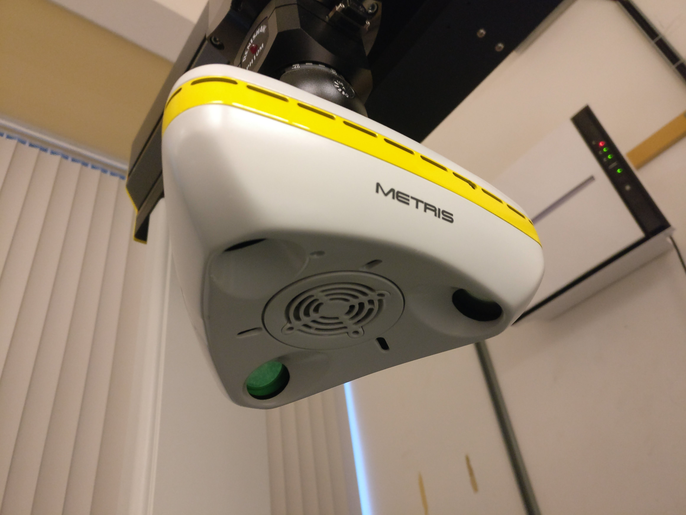
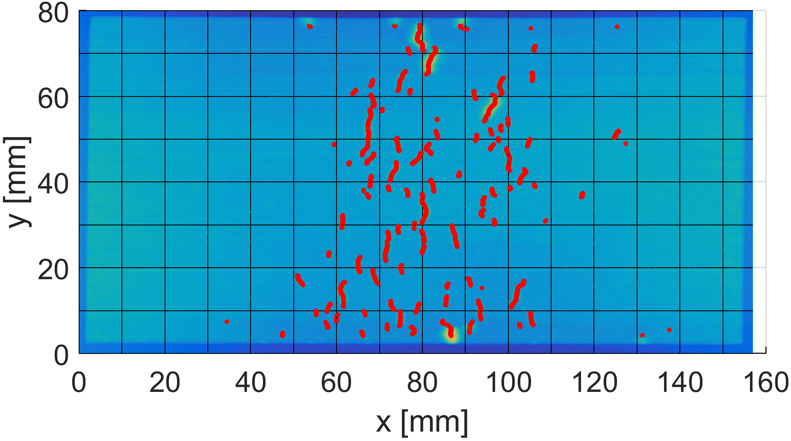
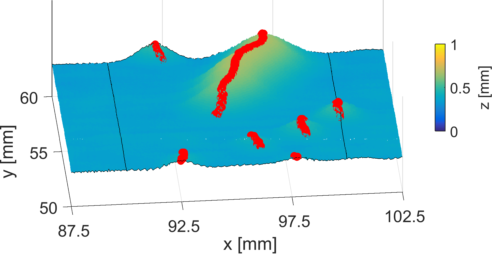
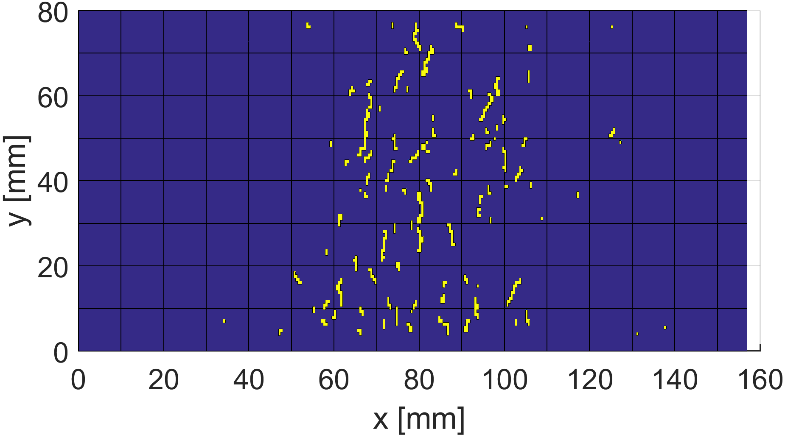
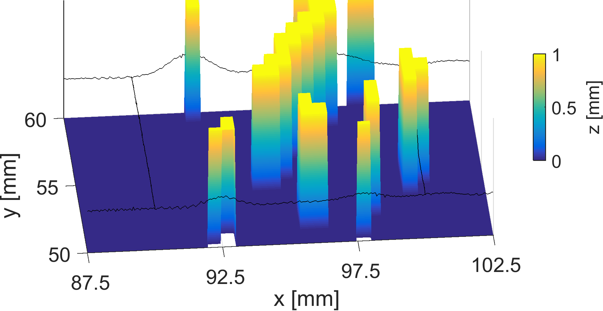
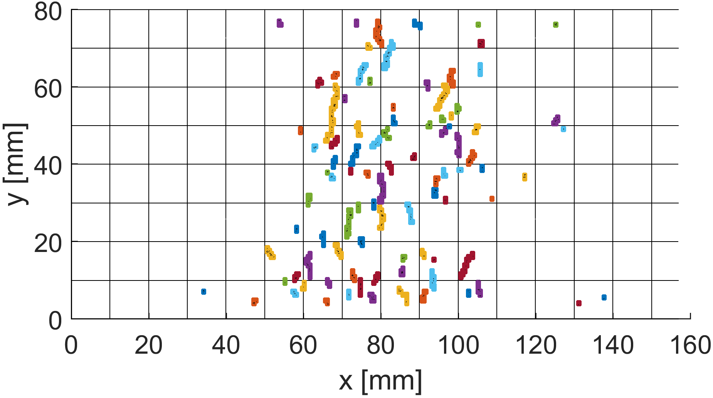
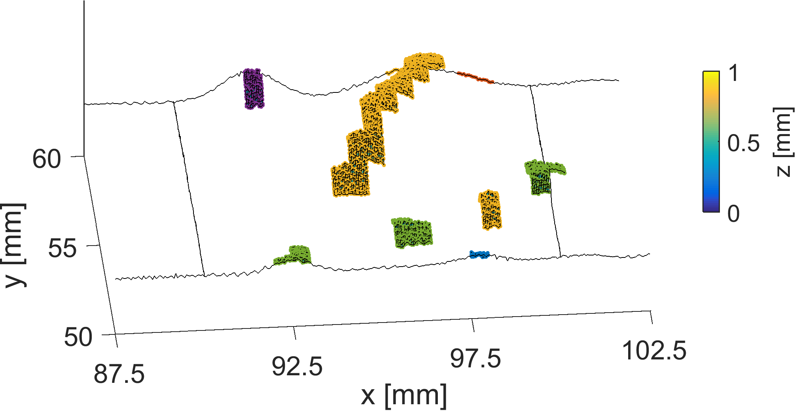
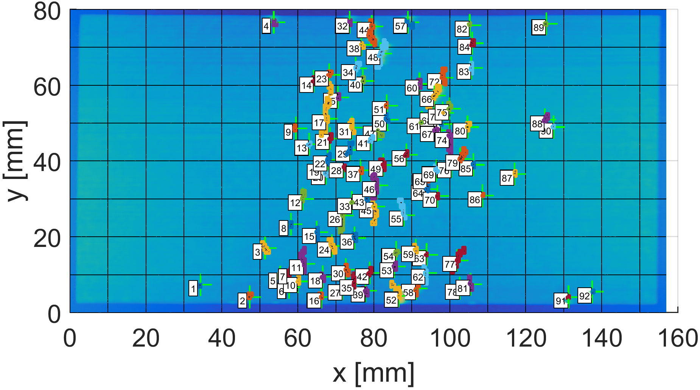
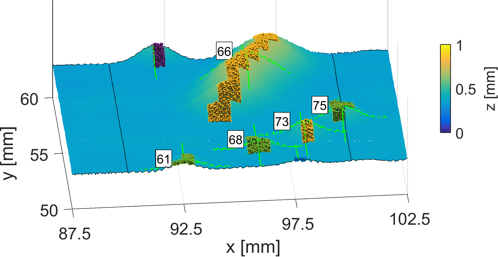

# Transient wrinke growth measurement using MATLAB
MATLAB scripts written to measure the size and shape of transient wrinkle growth in uncured carbon fibre reinforced polymers.  A full discussion of the method and procedure can be found in my [dissertation](https://open.library.ubc.ca/cIRcle/collections/ubctheses/24/items/1.0375794).

The goal of these scripts was to import the *(x,y,z)* point clouds and output geometric information for each wrinkle on the surface tracked through time.  The point clouds containing *(x,y,z)* coordinates of the surfaces were created using a Nikon Metrology coordinate measuring machine.  Each scan was approximately 500 MB in size and between 30 to 50 scans were made for each trial resulting in approximately 20 GB worth of data to be analyzed per trial.

|Nikon CMM             |  Metris laser scanning head|
|:-------------------------:|:-------------------------:|
||

The whole procedure involves several steps performed in series.  First, the 30 to 50 scans of an individual trial are imported, fewer scans can be imported to reduced memory requirements.  Some orientation and rotation steps are performed to ensure the x-axis corresponds to the lengthwise direction of the sample and the z-direction corresponds with the through-thickness direction of the material.  This is followed by peak detection along each of the gridded steps along the x-direction.  These peaks correspond with the wrinkles.  A 2D mask, combined with a small amount of padding, then converts the individual peaks, described in *(x,z)*, into regions, described in *(x,y)*.  This step merges adjacent peaks together so that individual wrinkles can be separated.  With this 2D mask, the MATLAB regionprops function is can be applied to segment the wrinkles.  With the segmented wrinkles, the width, height, length, and consumed excess length can be quickly calculated and stored in a table.

Each of the steps of this procedure are shown below.  The left images display a top-down view of the output of each step performed on the full surface while the right shows an off-axis projected view of each step performed on a single wrinkle on the surface.

<table>
  <tr>
    <td align="center"><b>Top-down</b></td>
    <td align="center"><b>Off-axis projection</b></td>
  </tr>
  <tr>
    <td colspan="2" align="center">Peak detection</td>
  </tr>
  <tr>
    <td></td>
    <td></td>
  </tr>
  <tr>
    <td colspan="2" align="center">Mask with padding</td>
  </tr>
  <tr>
    <td></td>
    <td></td>
  </tr>
  <tr>
    <td colspan="2" align="center">Segmentation</td>
  </tr>
  <tr>
    <td></td>
    <td></td>
  </tr>
  <tr>
    <td colspan="2" align="center">Measuring individual wrinkles</td>
  </tr>
  <tr>
    <td></td>
    <td></td>
  </tr>
</table>
